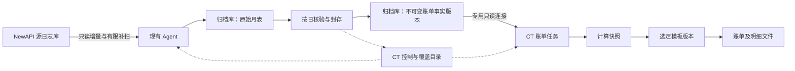

# 日志归档重设计：作为用户账单的持久数据源

**2026-09-21 追加式校验最新调整**：继续只读源表；默认流程改为源读取时捕获摘要、目标事务内逐批回读比较、归档库日终核对后封存，不再默认四轮核验或周期复扫最近7天。已结束历史通常读源一次；曾实时采集的日期结束后额外收尾补齐一次以覆盖迟到插入。新增归档库022 `archive_scan_evidence`，源逐行hash复用既有核验明细表；依赖仅追加、迟到有界和未归档不清理的声明，不声称源快照一致性。覆盖下文旧实现说明，详见[最新操作说明](archive-workflow-operations.md)。

**2026-09-21 源库减压修正**：统一任务取消独立全历史预扫描及穿插的 ID 增量扫描，改为最早日期逐页补齐、核验、封存后向前推进；追到当天继续时间游标，全部阶段遵守配置批次间隔，近期复查间隔放宽至至少 24 小时。受阻日期保留并继续后续日期。以[最新操作说明](archive-workflow-operations.md)为准，覆盖下文旧执行链路描述。

- 日期：2026-09-21，Asia/Shanghai。
- 状态：整体方案分批实现中。P0–P4、简化 P5 金额快照及全量归档统一任务已在本地落地；P6 归档账单尚未完成，未部署。
- 后续：按 [P0–P9 实施步骤](implementation-log-archive-billing.md)推进；基础准备见[操作说明](archive-foundation-operations.md)，可靠写入见 [P2](archive-p2-operations.md)，补齐、覆盖证据和预算见 [P3](archive-p3-operations.md)，持久核验、差异修复和封存见 [P4](archive-p4-operations.md)。扫描完成仍只是待核验，封存版本也不替代历史金额配置和账单异常门禁，不能将本文全部设计视为已实现功能。
- 结构细化：[数据库结构](schema-log-archive-billing.md)给出两库职责、字段/键/关系、核心 DDL 草案及新旧表兼容；归档账单结果增加版本化维度的独立汇总表，legacy compact 表保留。
- 需求：重新设计日志归档，后续用户账单使用归档日志生成。
- 核对基线：本地 main / `9de6735f`，保留工作区原有修改。
- 与账单管理整体方案（独立设计稿，另行提交）衔接：本方案补充数据基础和生成门槛；模板、客户包、人工复核继续沿用原设计。这里的封存校验不等于账单人工审批。

## 2026-09-21 全量归档统一任务（优先于下文分步操作）

按用户确认，入口收敛为一次全量归档，不要求选择日期。Agent 持久任务接入旧月表、重建衍生台账统计、扫描源历史，自动调度逐日补齐/核验和跨日封存，完成后持续增量。同 ID 且内容一致不重写，缺失补入、变化留审计修复、目标独有记录保留并阻断相关核验。现有后端日期协议继续作为内部步骤；源保留/稳定声明仍需符合真实运维策略，归档完成不自动生成账单。迁移、恢复和边界见[统一任务操作说明](archive-workflow-operations.md)。

## 2026-09-21 金额口径调整（优先于下文原时间线方案）

按用户确认，金额配置简化为创建账单时自动只读采集站点口径，并与账单事务绑定不可变快照。当前已接入用户/上游 statement；基础金额继续使用 `quota / QuotaPerUnit`（USD），币种显示和汇率另存，模型/分组倍率不重复相乘。CT 088 保存观察时间、来源、精确字符串和校验和；失败任务重新创建也复用原快照。原有人工历史区间确认、配置时间线和覆盖解析不属于本批要求，不把观察时间推断为历史有效期。P6 归档版本绑定和完整离线出账仍待实现，参见[现行 P5 范围](implementation-log-archive-billing.md#8-p5自动采集并固定金额快照)。

## 1. 推荐结论

采用“原始日志归档 → 按日核验和封存 → 从固定版本生成账单”。继续使用现有 Agent 和每个源数据库专用的归档 MySQL，CT 保存控制、目录与任务；新增账单专用只读通道。

核心变化是把“复制了多少日志”提升为“哪些日期已核验、哪一版数据可出账”。未来新用户账单只从已封存版本读取；缺一天、校验失败或金额单位不明时，明确阻止正式生成，不能自动回退线上日志或生成部分账单。

一期继续 MySQL 月表，不引入新的消息队列或独立分析集群。原始月表支持核查和补齐，账单事实快照保证历史不变，派生汇总加速查询；三个用途各自明确。

## 2. 当前实现与需要补足的部分

下表记录设计开工时的 legacy 基线，用于说明改造动机。新版 P1–P4 已用目标事务游标、持久数据集/epoch、日期任务和封存版本替代相应限制；具体当前行为见顶部各阶段操作说明，旧账单路径尚未切换。

| 当前代码事实 | 对未来出账的影响 | 改造方向 |
| --- | --- | --- |
| Agent 复制全部类型、全部源字段到 `logs_YYYYMM`，保留 `other`；按北京时间分月 | 已有较完整的原始证据基础 | 保留这条采集路径，账单从受控字段投影读取 |
| 明细、ID 去重贡献、日/月统计同事务，批次回读比较字段 | 能证明本批写入正确 | 保留，不把它称为整个账期完整 |
| 增量以本地 `id > AfterID` 推进，默认延迟 300 秒 | 可能遗漏小 ID 晚提交、历史补写及已归档后的修改 | 独立回补游标、按日覆盖检查和差异修复 |
| 每日记录只在有归档行时上报，`request_rows` 含 type 2 和 5 | 无记录可能是零业务，也可能是漏采；请求数不等于计费订单数 | 全日期覆盖目录，单列 type 2 消费日志数 |
| 按日对账要求暂停归档，只有最近一次摘要结果，不自动补洞 | 依赖人工，不能作为稳定的月结前置流程 | 持久化核验任务/历史、低优先级调度、修复后复验 |
| 源库/目标库防同库检查、CT 执行会话授权已存在 | 尚未形成跨换节点/换源代际的持久数据集绑定 | 新增 dataset 与 source generation，不把 Agent 身份当数据身份 |
| 用户账单通过 `BillingReadonlySource` 读取线上日志，并读取当前 options/余额 | 换日志表仍会依赖源站，换算配置可能随步骤变化 | 新建 ArchiveBillingSource，任务固定全部输入 |

现有日/月统计属于归档观测值，不是用户账单汇总；不能直接把它们按比例分配给用户。具体实现证据见第 15 节。文档记录不作为生产已部署的证明。

## 3. 数据身份、职责和访问路径

### 3.1 数据身份

- `site_id` 表示归属站点；`archive_dataset_id` 表示一套持久归档数据；`source_generation_id` 表示同一源日志 ID 空间的连续代际。
- 日志业务键为 `(dataset_id, source_generation_id, source_log_id)`。`request_id` 只用于请求关联，重试/fallback 可共用它，不能据此去重扣费。
- 一期每个数据集专用归档 schema，模板与原始月表继续使用原有 ID 结构；换源代际分配新 schema/数据集目录，不能把重置后的 ID 混入旧月表。
- 归档库保存 dataset 元数据并与 CT 注册记录互相核验。物理 server UUID、库名、schema 指纹用于检测环境变化；单纯 RDS 主备切换不自动判成新业务代际，需验证连续性后恢复。
- 换 Agent、地址或密码不改变已确认的数据身份。更换源库、从旧备份恢复、ID 回退、跨站点重绑时先阻断续写，执行身份迁移核验。
- 用户和令牌身份同样包含 source generation；源重建后相同 user_id 不能自动当成同一客户。账期跨代际时先显示身份断点，一期分别生成，不按同名或同 ID 自动合并。
- 控制请求、日目录、核验回执、账单任务都携带 dataset/generation；拒绝旧会话或错误数据集的上报，不把旧站点日记录改名后归入新站点。

### 3.2 执行与读取

- Agent 使用源只读连接和归档写连接，继续出站通信；CT 不接收原始日志批次，不进入 NewAPI 请求链路。
- Server 新增归档只读连接配置，凭据通过部署密钥配置，页面仅显示连接状态和数据集标识。它不能复用 Agent 的写账号。
- Server 只读已封存事实和 manifest，不读取可变原始表来生成正式账单；CT 自己的库继续写任务、计算结果、审计和产物目录。
- 归档库必须能被 Server 网络访问，这属于实施前需核验的部署条件。暂不可达时显示“归档读取未配置”，不通过 Agent 控制轮询传输海量账单数据。
- 当前使用日志实时查询页面保持原路径；本轮不做实时/归档自动拼接。上游账单预留相同 reader 接口，但一期切换范围是用户账单。

## 4. 存储设计：原始证据、账单事实、可重建汇总

以下为逻辑表与建议命名，最终迁移按仓库当时最新序号分配。

| 层级 | 数据和建议载体 | 约束 |
| --- | --- | --- |
| 原始证据 | 现有 `logs_YYYYMM`、`logs_undated`、`archive_log_state` | 保留原始字段、NULL 与类型；不扩展采集请求/响应正文 |
| 身份/游标 | 新增 `archive_dataset_meta`、`archive_checkpoints`、`archive_batch_receipts` | 归档目标中提交；游标与本批明细、统计同事务 |
| 核验/封存 | `archive_day_versions`、`archive_reconcile_runs` | 每日每版不可变 manifest，保留历次结果与证据范围 |
| 封存计费原文 | `archive_billing_evidence_YYYYMM` | 按内容摘要去重保存计费原字段及 other 原文，版本引用不随镜像修正而变化 |
| 账单事实 | `billing_facts_YYYYMM` | 按 `day_version_id + source_log_id` 唯一；已发布版本禁止 UPDATE/DELETE |
| 派生汇总 | 按日/用户/令牌/模型/分组/规则/单位版本汇总 | 绑定 day_version 和 parser_version，可重建，不替代明细 |
| CT 目录 | 现有日记录扩展/新覆盖目录、账单输入 manifest | CT 状态是投影，最终就绪状态以归档 manifest 为准 |

事实层至少保留全部 type 2 消费记录，包括零价、零输出以及解析失败的记录；其他日志类型原样留在证据层。异常记录不能在标准化时悄悄丢弃。未来退款/冲正若采用别的日志类型，必须扩展显式规则和版本，不能把所有类型 quota 一起求和。

Agent 负责在归档库构建事实与封存版本。将现有读取器的账单字段提取/规范化抽为 Agent 和 Server 都可引用的根级共享模块，避免跨 Go internal 包边界或复制两套解释器；源库 reader 与归档 reader 用相同契约回归。事实保存重放所需证据，金额计算仍由固定版本的 Server 账单引擎完成。

必要字段分组：

- **定位**：数据集/代际、日志 ID、原始时间戳、账务日期、用户 ID、令牌 ID、模型、当时的分组、内部渠道 ID、request_id，以及来源行摘要。
- **展示身份**：日志中的用户名和令牌名快照；无名称时以稳定 ID 展示。用户/令牌后来被改名或删除，不影响历史查询。
- **原始金额和用量**：整数 quota、原始 prompt/completion、缓存读取/写入及 5m/1h、图像和音频用量、按次/工具附加费所需数据；保留缺失与明确零的区别。
- **计费证据**：原始 `other` 留在受限证据层；被封存版本引用的 other 和必要原字段按内容摘要另作不可变保存，不能只指向可被 upsert 覆盖的月表行。事实层保存版本化白名单投影及未解析状态，覆盖倍率、表达式/命中档位、`usage_billing_path`、缓存/多媒体语义等现有账单读取字段。遇到未知计价结构，保留引用并标记，不能丢弃后声称可重算。重新解析生成新事实版本，不能修改旧事实。
- **版本与异常**：源 schema 指纹、提取/解析版本、归档批次、day_version、字段完整性和异常原因。标准化的显示 Token 与计算输入独立，避免解析升级改变旧计费。

只有归档目标需要新增账单索引；源库不加 DDL。事实层优先验证 `(day_version_id, user_id, created_at, source_log_id)` 的执行计划，主键/唯一键固定身份。按月份、日期逐段 keyset 读取，最后一段仍带精确时间条件，避免大 OFFSET 或假设 ID 与时间严格同序。

## 5. 采集、补齐与低影响运行

1. **持续增量**：沿用 ID 前向读取和源库时间延迟；以行数、解码字节数、耗时三重预算约束。正常状态分批连续推进，追平后降低查询频率。
2. **近期回补**：默认建议覆盖最近 7 天的滚动时间块，按 `(created_at,id)` 遍历，独立 checkpoint；优先完成昨日，再轮转其他日期。7 天是可调整的运维初值，不是完整性保证，也不是每天全量扫七遍。
3. **指定历史补齐**：仅对选定缺口日期排队，不重置主增量游标；源已有 `created_at` 开头的合适索引才运行，否则明确报能力不足。
4. **写入与恢复**：把权威 checkpoint 移至归档目标，与明细、旧贡献差额、回执同事务提交；本地文件改为缓存。提交成功但响应丢失时根据批次幂等键恢复；不得由 CT 展示进度推高游标。
5. **单写者约束**：保留 CT 短期会话授权，在归档目标增加递增执行 epoch。每次事务锁定并核验 epoch；新执行者接管后旧 epoch 不能提交。控制授权与目标 epoch 共同校验，所有补扫/封存写入都走同一约束。
6. **预算调度**：一个站点一个受控源读取任务，增量优先；回补、核验共享明确预算，积压过大时给核验留有限配额并报告无法追平，避免永久饿死。按日封存锁只作用于目标日期，不全站暂停。

初始建议：延迟 5 分钟；每批最多 500 行、约 4 MiB 解码数据、最长 30 秒；吞吐预算按实测调整，不照搬固定低吞吐间隔。超大单行必须有明确上限与阻断/隔离记录，不能跳过后继续把日期标完整。元数据检查按 schema 版本缓存，遇到 schema 错误立即失效重检。

`500 行 / 30 秒` 理论仅约 144 万行/日，且尚未扣除执行耗时和补扫，不能作为所有站点的通用配置。先测每日行数、平均/峰值字节、查询耗时，再保证处理能力高于新增速率并留出追赶窗口。

## 6. 完整性与封存：正式账单的门槛

### 6.1 每个日期必须有状态

按站点实际启用覆盖起点建立日历记录，不从“首条现存日志”推断完整历史。状态包括：采集中、待补齐、核验中、有差异、已封存、无法验证；日期没有日志也必须经过成功核验才可标“已封存 · 0 条”。缺月表、查询失败或没有上报不等于零业务。

运行状态（运行/暂停/离线/失败）、完整性状态、账单状态分别展示。增量已经追平也不能自动把历史日期标为已封存。

### 6.2 核验内容和保证边界

建议 T+1 凌晨在延迟窗口后启动昨日核验；03:00 可作为初值，实际由站点负载和日志最长迟到时间决定。

核验保存全日行数、类型分布、type 2 条数/整数 quota 合计、原始 Token 合计、稳定排序后的 ID 和字段摘要、源 schema 指纹、扫描起止时间、采用的稳定性条件及任务版本。复用现有区分 NULL/空值/字节的摘要编码；对比摘要时两侧使用同字段/同顺序/同编码。分块摘要用于定位差异，不能仅比较 MAX(id)、行数或金额总和。

这里有一个必须明确的技术边界：**只读分页轮询不能证明任意迟到事务、任意历史修改或早已被删除的日志都被捕获。** 五分钟延迟、最近七天回补或两次扫描一致都不是绝对证明。

- 一期要求站点满足“日志主要追加、已结束日期在约定稳定期后不再变更、核验完成前不清理”的运行契约，并记录证据有效截至时间。超出契约的变更进入修订流程。
- 可以在源负载允许的时限内，用一个只读一致性事务扫描该日并记录快照边界；超时作废重跑。超大日期需在已冻结的只读副本/一致快照上核验，或者在明确的历史日期不再变更契约下分批核验并标注保证等级，不能把不同事务的分页包装成同一时刻快照。
- MySQL `REPEATABLE READ` 的一致视图约束在同一事务内；两个数据库的独立事务没有天然共同快照。[MySQL 官方一致性读说明](https://dev.mysql.com/doc/refman/8.0/en/innodb-consistent-read.html)
- 若业务必须支持任意历史改写且自动完整捕获，需要另行评估 CDC/数据库一致快照能力；这会改变当前只读轮询的部署前提，不能通过扩大回补天数假称解决。
- 源数据已清理、且没有清理前的有效完整性证据/可验证备份时，状态为“历史完整性未知”；保留已有数据，但不放行正式完整账单。不能把已经被清空的源表与空归档相等视为成功。

### 6.3 修复与版本发布

源有目标无：按缺失 ID 补齐；字段不同：记录修正前后摘要，再更新原始镜像并使相关旧/新日期的待发布版本失效。目标有源无：保留证据，标明可能发生源清理或删除，不能自动删除归档去“对平”。时间跨日/月修改必须同时处理两侧归属，不能只查新的日期。

开始目标核验扫描前记录该日 revision，所有影响该日数据的写入均递增 revision。完成核验后，在短事务中取得该日写入冻结标记并确认 revision 与核验开始时相同；发生变化则作废该次核验重跑，不能将核验结束与冻结之间的新增数据当作已验证。成功后分批构建计费原文证据、新事实快照、异常清单和汇总，摘要明确绑定本次成功核验的目标集合。所有会影响该日的归档写入必须检查冻结标记；遇到冲突暂存为待重试任务且不推进对应游标，其他日期可继续。不得边覆盖原始行边构建同一版本。

构建完成再核对事实行数、type 2 quota、原始行摘要映射和汇总守恒，最后短事务原子发布 manifest。失败/重启只留下不可读的 building 版本；CT 未收到上报也能从归档 manifest 恢复，CT 显示成功但目标未发布时仍禁止读取。

manifest 至少包含 dataset/generation、日期 `[from,to)`、day_version、原始行与消费行计数/摘要、schema/parser 版本、核验方法与时间、异常计数、状态及前一版本引用。已发布事实和 manifest 不原地改写；是否被新版本替代放在独立目录状态中。

“日志已封存”与“账单可生成”仍有区别：可生成还要求 CT 的金额配置有效期覆盖、对象归属和所选过滤/算法能确定。缺配置不阻止保存原始证据，但要在页面显示“已封存，待确认金额口径”；任务 manifest 另外固定配置版本。

封存后发现变化，先把该日当前目录标为“待修订”，暂停其新账单创建；构建 v2，复验后切换当前指针。旧账单继续引用 v1，显示“数据有后续修订”；重新出账须显式创建账单修订版，不能覆盖已交付文件。

跨日/月时间修正属于一个修订批次：旧日和新日一起失效、一起复验，全部准备好后在归档库同一短事务发布对应日期指针及 `catalog_revision`。账单一次读取同一个 catalog revision 下完整的日期版本集合；禁止组合旧日 v1 与新日 v2 造成重复计费。CT 按整批目录投影更新，不能将逐日迟到回执拼成有效账期。

## 7. 账单金额、配置快照与业务过滤

**日志数据来源**（archive / legacy live）与**金额计算方式**（newapi / recalculate）是两个不同字段。使用归档不意味着必须重新计价。

- 默认保持 NewAPI 实际扣费口径：消费日志 `quota / 对应有效期的 QuotaPerUnit`。不要使用今天的模型价表推算历史金额。
- 优先保存原始整数 quota 并用有理数/十进制计算；按同一配置版本聚合整数后换算，跨版本精确累加，最后按固定舍入规则输出。不可先把每个汇总行舍入再反复累加。数据库精确值可用适当范围的 DECIMAL，并显式处理溢出和 scale；[MySQL 官方精确数值说明](https://dev.mysql.com/doc/refman/8.0/en/fixed-point-types.html)。
- 保存 QuotaPerUnit、单位/币种、展示换算因子及有效期、来源、观察时间和证据。源 options 定时快照只能证明观察时的配置，不能自动证明两次观察间的实际生效时间；变更边界不明的区间暂停正式换算，待补足已确认有效期。
- 配置观察由 CT 的独立只读配置采集任务复用当前 options 读取能力，持久化到 CT 配置版本库，生成任务只读已保存版本；Agent 的源账号无需因此获得写权限。配置采集失败不能用默认值填补时间线，已具备有效配置覆盖的归档账单不依赖该任务在线。
- 历史原始日志通常不自带完整 QuotaPerUnit 历史。没有可信历史证据时不能默认当前值或静默写 500000；支持带审计的历史口径确认，标注“人工确认”及范围，区别于实测。只能核实 quota 的数据可内部预览 quota 汇总，不伪造货币金额。
- 重算模式继续使用日志中的历史倍率/表达式；锁定解析器、usage_version、计价引擎版本。缺规则时保留现行“实际扣费兜底”的明确标志与差异，不将混合结果展示成纯重算。原始扣费模式不因缺少展示单价而直接丢单。
- 消费日志 type 2、错误日志 type 5、充值日志分别处理。零输出过滤、结构异常规则都在任务快照中固定；被排除行的数量和 quota 单独展示，并满足“原始消费合计 = 纳入 + 排除/隔离”检查。
- 零价、零输出、有图像/音频但无普通输出、令牌 ID 缺失、用户被删除等场景不能在归档层消失。未能归属用户的消费记录进入站点异常池，不能给任意用户；存在无法界定影响范围的异常时阻断该日正式出账。
- `logs_undated` 中的消费记录、无法解析的日志类型及未知类型中的非零 quota 均进入独立隔离清单。无法确认所属账期的收费异常阻断该数据集尚未完成影响评估的新正式账单；处理时保留依据和原记录，不能随意归入发现当天。坏 `other` 需按影响区分：确定 quota/单位的原始扣费可保留金额并提示用量/规则缺失，依赖这些字段的重算或过滤无法判定时阻断，不能把 NULL/缺失转成零后放行。
- 现有最大上下文/结构异常判断依赖模型元数据，也必须记录任务采用的元数据版本。不能因为当前模型信息改变而让重试少算几笔。
- 用户账单不应用上游渠道折扣。余额不属于消费日志事实，不能以当前余额填历史期末余额；一期消费账单移除发布时对线上余额的强依赖，需要余额时只展示有独立证据的对应时点快照及观察时间。

## 8. 用户账单生成流程

1. 选择站点、历史用户、账期和模板。用户候选可从归档用户目录检索，不能要求用户目前仍在 NewAPI users 表。
2. 服务端检查每个相交日期的覆盖、核验、最新封存版本和金额配置覆盖；精确时间账期仍按 `[from,to)` 过滤。完整日封存是一期最低粒度，今天或尚未封存日期仅允许内部预览，不生成正式账单。
3. 固定输入 manifest：站点/dataset/generation、各日版本、精确账期、用户、过滤条件、金额配置、schema/parser/usage/计价/异常规则及模型元数据版本；模板另存不可变版本。
4. 从同一 manifest 读取逐条事实并计算，产出主账单、每日/模型/令牌汇总、允许导出的明细；所有展示由同一输入派生，避免页面、Excel、每日文件各算一套。
5. 数量/quota/金额守恒及产物校验通过后发布。文件生成失败只重试同一计算与模板快照；重试不得重新选择最新日版本。

创建前检查之后仍可能发生修订或清理，因此创建/入队需加 dataset 目录修订号校验和保留引用。ArchiveBillingSource 读取时再次检查 manifest；一旦已固定版本，可继续同版计算，禁止自动换版。清理和任务引用必须互斥，详见第 11 节。

查重分两层：同一业务范围与参数先识别原账单；同一输入 manifest 的重试幂等。输入版本变化应提示“已有账单，可创建修订版”，通过显式修订动作关联原单；不能简单把 manifest hash 加进查重键就允许普通生成按钮重复出账。更换模板仍不绕过业务查重。

接入上新增 ArchiveBillingSource，复用当前 JobRunner/文件生成，但把本任务输入读取集中到不可变上下文中；移除 archive 模式步骤中及发布时的 RatioSnapshot/Balances 线上读取。老任务固定 `data_source=legacy_live` 并保留旧语义，不在重启时自动切源。

现有 PageSource 只有站点/期间参数，需要增加 snapshot 参数或以 `OpenBillingSource(jobSnapshot)` 返回绑定版本的 reader。新用户账单的详情、逐请求/令牌导出及核对入口全部读取同一任务版本；旧独立实时导出继续明确标注实时来源，不从新账单详情跳过去冒充同版结果。失败重试也要保留原 manifest，不能套用现有删除失败任务后重新绑定最新数据的逻辑。

生成确认页示例文案：“9 月 1–30 日，共 30 天；已核验并封存 29 天；9 月 12 日有差异，暂不能生成正式账单”。入口可直接定位该日补齐/核验，账单权限不自动授予归档管理权限。

## 9. 页面重新组织

详细布局、双状态文案、账期预检、任务交互与接口建议见 [日志归档页面设计](design-log-archive-page.md)。该页面设计与交互原型均未接入业务后端。

保留“日志归档”入口，页面内分三部分：

| 页面区域 | 用户需要看到的内容 | 主要动作 |
| --- | --- | --- |
| 归档总览 | 当前站点、采集状态、可出账覆盖区间、缺口/异常天数、最后成功与数据延迟 | 暂停/恢复、连接诊断 |
| 每日数据 | 日期、原始/消费日志数、quota、完整性、当前版本、核验时间、关联账单 | 查看差异、补齐、重新核验、查看历史版本 |
| 任务与策略 | 增量/回补/核验任务状态和历史；执行节点、预算、稳定期、保留策略 | 重试失败任务、设置策略 |

月份展示完整日历范围，零业务、缺记录和未知历史分别显示；未处理日期不能统一标“已归档”。主指标优先是“哪些日期可出账”，已提交日志 ID 收进执行详情。未经可靠分母计算，不显示完整率百分比。

账单详情增加“数据依据”：归档站点/数据集、账期、版本摘要、核验时间、金额来源和配置来源；技术摘要可折叠。普通客户文件显示必要的账期和金额口径，不暴露 DSN、渠道/上游、内部核验细节。

手机使用同一数据结构的日卡片，保留日期/状态/消费行数/动作；长任务详情独立页。具体视觉实现与现有 Element Plus 及主题保持一致，不在方案阶段额外增加技术参数面板给普通账单用户。

## 10. 权限、异常和可观测性

- 复用 `archive.manage` 管理归档；账单读取仍经现有账单权限和站点校验。凭据管理、不可逆清理、修订发布如拆新权限，迁移时不默认扩大受限管理员权限。
- 原始日志含 `content`/`other` 等内部信息；Server 的账单账号优先仅授权事实与 manifest。所有客户文件使用统一白名单，模板不能访问未授权内部字段。
- 持久记录策略修改、数据身份迁移、补齐/核验/封存、账单修订及清理审计，记录标识/摘要和结果，不记录密码或原文内容。
- 指标包括源/目标耗时、读写行和字节、最后成功、可出账截至日与中间缺口、积压年龄、差异数量、单位配置缺口、磁盘容量、最近恢复演练。归档告警不影响监控/已有告警线程。
- schema 变化时暂停受影响数据集的发布，保留已提交数据；探测新 schema 并完成归档目标兼容迁移后续跑。未知字段/新计价结构进入版本升级流程，不静默按旧解析器出账。

## 11. 保留、备份和容量

源库清理与归档库保留分别设计。CT 一期仍不删除源日志；可以提供“可评估清理的覆盖范围”报告，真实源清理由已有运维流程处理，不能只看 last_id 就删除。

在尚无实际量级与保留要求时，建议先按以下容量假设估算：源日志 30 天，归档原始明细在线 12 个月，事实快照/manifest/账单按需要复算的历史期限保留。以上是待确认的运维建议，不是法定期限或自动生效配置；一期默认不开自动删除。

- 空间按 `日行数 × 实测原始行平均字节 × 天数 + 索引 + 事实层 + 修订版本 + 备份` 估算。例：100 万行/日、每行 2 KB，30 天原始数据约 60 GB，未含索引、事实与副本；只用于说明估算方法。
- 在线 MySQL 支持日常账单；超过在线保留期可后续压缩导出到对象存储，带 schema、manifest、校验和与恢复验证。冷数据先恢复到隔离归档区再出账；一期不承诺直接查询冷文件。
- 同一个 RDS 内的第二份数据不等于可恢复备份。需要独立备份、加密、恢复演练和容量监控，清理前验证可恢复性。
- 事实版本、账单输入 manifest、计算快照及引用版本不能因原始月表过期而一起删除。需要保留重解析能力时，原始证据也必须在线或可恢复。
- 清理以数据集/月份为单位核对依赖，更新明细、辅助去重记录、统计与目录，不能手工只 DROP 一张月表。归档历史清理后设置保留边界，旧 checkpoint/补扫不得自动重建已清理范围。
- 跨 CT/归档库不假设有分布式事务：由 CT 统一持久化保留引用和清理互斥状态。创建先取得目录锁登记保留引用，清理先标 deleting 并确认无引用，再由 Agent 执行；中断后恢复同一个任务，拒绝对 deleting 数据创建新账单。发布和清理回执均校验数据集/版本。

## 12. 兼容迁移与交付顺序

### 阶段 A：归档可靠性和数据目录

注册 dataset/generation；目标内原子 checkpoint 与 epoch；增量预算；近期/指定回补；日历覆盖、核验历史、零日志日、差异定位。旧原始月表继续使用，旧日统计标注“尚未完成新版核验”。不能直接把旧“已归档”升级为可出账。

旧归档导入要核查源身份、表结构、ID 冲突、时间覆盖和辅助统计；源仍保留的区间执行逐日核验。源已删除的区间只有可验证历史凭据或备份才能提升完整性等级；无法证明的部分保留并公开缺口。

### 阶段 B：封存事实与用户账单切源

实施每日不可变事实/manifest、配置有效期与异常处理，增加 Server 只读 reader，调整 JobRunner 的固定上下文，服务端生成门禁、业务查重/修订关联、全部导出一致性。

选择一个站点，针对相同稳定日期与相同配置快照执行线上/归档双路径影子比对，不产生两份正式账单；验证原始行集合、纳入/排除、quota、金额、用量、各级汇总和实际生成文件。验证后设置切换边界，新用户账单强制 archive；历史缺口不自动回退 legacy。

### 阶段 C：存储和运营优化

根据实测增加聚合加速、冷存储/恢复、定期恢复演练和保留清理。大型数据量或任意历史修改需求再评估分析存储/CDC，不能以此阻塞一期可靠性建设。

发布按 Server 兼容控制/迁移 → Agent 单站灰度 → 归档目标结构/身份核验 → 补齐封存 → 新用户账单切源推进。回退时暂停新 archive 任务并保留已发布版本；旧二进制不兼容新格式时不得接管续跑，新格式任务明确失败/等待升级，不能改成线上模式续算。

## 13. 必须通过的验收

1. 重复批次、提交响应丢失、磁盘检查点丢失、进程重启不漏不重；多个 Agent/旧会话不能共同提交。
2. 小 ID 晚提交、乱序时间、历史补写、字段修改和跨月时间修正能发现/补齐；超出保证范围的情况显示未知或待修订，不假称完整。
3. 中间缺一天、零日志日、缺月表、源已清理、日期未结束、无效日期/未归属用户分别正确阻断或展示；不能生成看似成功的部分账单。
4. 封存期间并发补扫、发布中断、CT 上报丢失、旧结果迟到、schema 改变均不发布混合版本；源不稳定时不能宣告同一快照核验通过。
5. 同账期含不同 QuotaPerUnit/币种配置，观察边界不明、缺历史价、零价、表达式、缓存 5m/1h、图像/音频、按次/工具费均有确定口径。
6. 账单金额来源与数据来源独立；默认原始扣费一致，重算保留兜底/差异；纳入与排除行数/quota 守恒，显示拆分不反向改变计价。
7. 删除/改名源用户或令牌，修改当前模型价、余额、模型元数据，源数据库彻底断开后，已具备归档快照的新账单仍可独立生成和重试。
8. 跨月/精确时间边界、部分日、同 request_id 多条日志、极大整数和小额精度，主表/每日/令牌/明细一致，超限不可静默截断。
9. 数据修订产生新版和显式账单修订，旧单金额与文件 hash 不变；更换模板不产生重复业务账单。
10. 跨站点、旧 dataset 回执、猜测文件地址、无归档管理权限的账单用户、原始/客户文件边界均经过服务端验证。
11. 清理与入队并发、冷数据恢复、备份恢复、旧 checkpoint 重放、源/目标错绑均按约定处理；做一次真正的恢复演练。
12. 用真实量级测归档追赶时间、补扫/核验时长、源库 CPU/IO/P95 查询耗时、Agent 内存与监控延迟，再确定批量和预算。

实现阶段按项目规则运行 Go vet/test、Web typecheck/build；另需真实 MySQL 的并发/恢复/迁移验证、实际导出文件及数据过滤检查。本文没有把这些未来验收写成本次通过。

## 14. 实施前需补齐的环境信息

每站点日均/峰值日志量、平均行字节和预计保留期；现有归档库版本/容量/独立备份；源清理策略及是否会历史补写/修正；Server 到归档库网络；已有历史 QuotaPerUnit/币种变更证据。

这些信息影响容量、核验方式和历史覆盖，暂不影响本方案的数据职责与出账门槛。默认以现有每源独立 MySQL 归档部署为起点，不擅自新建云资源。

## 15. 实现证据与文档关系

- [Agent 归档读写/检查点](../agent/internal/logarchive/archive.go)、[月表与统计](../agent/internal/logarchive/monthly.go)、[批次校验](../agent/internal/logarchive/verify.go)、[按日对账](../agent/internal/logarchive/reconcile.go)。
- [托管执行循环](../agent/cmd/control-tower-agent/archive_loop.go)、[站点控制及每日上报](../server/internal/mysqlstore/log_archive.go)、[现有日目录迁移](../server/migrations/073_log_archive_days.sql)。
- [归档现行说明](newapi-log-archive.md)、[现有页面](../webapp/packages/desktop/src/views/LogArchiveView.vue)。现行文档仍描述已实现功能；本方案是后续改造，不能用方案替换部署说明。
- [当前账单数据源与线上日志/配置读取](../server/internal/dashboard/passthrough_handler.go)、[JobRunner](../server/internal/billing/jobs.go)。
- [账单创建与查重](../server/internal/dashboard/billing_statements_handler.go)、[账期解析](../server/internal/dashboard/billing_jobs_handler.go)、[计费来源及用量](design-billing-source-mode.md)。
- 整体账单设计（独立设计稿，另行提交）、模板设计（独立设计稿，另行提交）。后续归档模式需要更新其生成前校验和输入快照契约，不能仅在前端增加来源下拉框。
